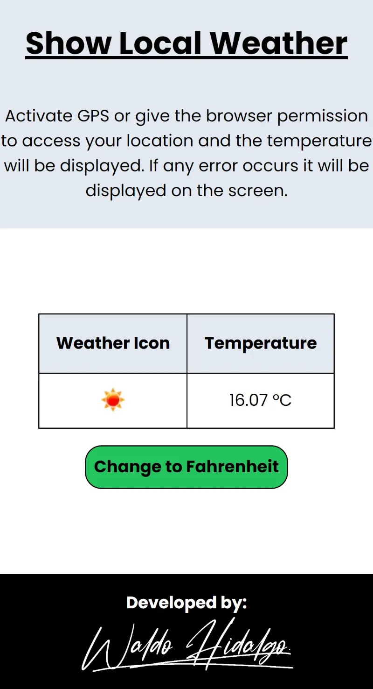

# Proyecto Show the Local Weather

El proyecto fue realizado como challenge de Freecodecamp según lo señalado en el siguiente link: [Show the Local Weather](https://www.freecodecamp.org/learn/coding-interview-prep/take-home-projects/show-the-local-weather).

EL proyecto obtiene la temperatura actual en base a la ubicación del usuario utilizando la **HTML Geolocation API**. Luego de obtener la latitud y longitud procedo a realizar una query a la [**freeCodeCamp Weather API Passthrough**](https://weather-proxy.freecodecamp.rocks/). Dicha API la entrega freecodecamp para realizar este proyecto.

El proyecto corresponde al sexto proyecto requisito para obtener la **Legacy Front End Certification**.

## Tabla de Contenidos

- [Proyecto Show the Local Weather](#proyecto-show-the-local-weather)
  - [Tabla de Contenidos](#tabla-de-contenidos)
  - [Proyecto Aprobado](#proyecto-aprobado)
  - [Proyecto Finalizado](#proyecto-finalizado)
    - [Temperatura Trabajando](#temperatura-trabajando)
    - [Temperatura Convertida](#temperatura-convertida)
    - [Negación Uso de Geolocation API](#negación-uso-de-geolocation-api)

## Proyecto Aprobado

## Proyecto Finalizado

### Temperatura Trabajando

### Temperatura Convertida

### Negación Uso de Geolocation API

